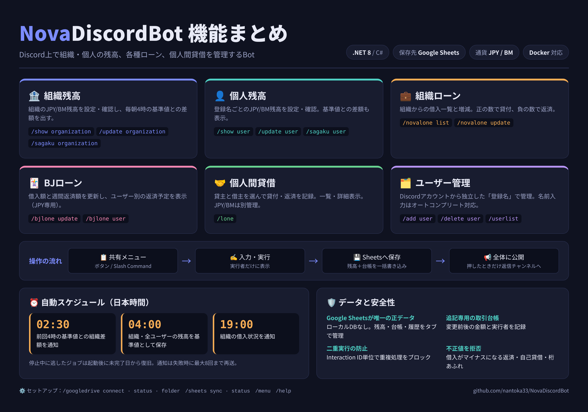

# NovaDiscordBot

Discord上で組織残高、個人残高、組織ローン、BJローン、個人間貸借を管理する .NET 8 Bot です。



**Google Sheetsを業務データの唯一の正データ（Single Source of Truth）として使います。SQLite、EF Core、DbContext、Migrationは使用しません。** Bot起動時にローカルの業務DBを作成する必要はありません。残高、操作履歴、スナップショット、ジョブ履歴、通知OutboxはGoogle Sheetsから読み書きします。

## 必要なもの

Dockerで動かす場合は、DockerとDocker Composeだけで動きます（.NET SDKは不要）。手順は「[Dockerでの起動](#dockerでの起動)」を参照してください。ソースから動かす場合は、次のものが必要です。

- .NET 8 SDK
- Discord Bot/Application
- Google Cloudプロジェクト
- Google Drive APIとGoogle Sheets API
- OAuth 2.0 Web Applicationクライアント
- Botから到達できるOAuthコールバックURL（ローカル開発ではlocalhost可）
- Google Driveの保存先フォルダ（`GOOGLE_DRIVE_FOLDER_ID` に設定するか、起動後に `/googledrive folder` で設定します）

## Discord Bot設定

1. Discord Developer PortalでApplicationとBotを作成します。
2. Bot TokenとApplication IDを設定します。
3. Botをサーバーへ招待し、`bot` と `applications.commands` のscopeを許可します。
4. `.env` に `DISCORD_TOKEN` と `DISCORD_CLIENT_ID` を設定します。
5. 開発時に特定サーバーへすぐSlash Commandを反映する場合は `DISCORD_GUILD_ID` を設定します。省略するとグローバル登録になり、反映に時間がかかることがあります。
6. Botをサーバーに追加すると、`menu` / `bot返信用` / `通知用` の3チャンネルを自動作成（同名の既存チャンネルがあれば再利用）し、そのIDを自動登録して共有メニューを投稿します。この登録値は `.env` の `DISCORD_MENU_CHANNEL_ID` / `DISCORD_REPLY_CHANNEL_ID` / `DISCORD_NOTIFICATION_CHANNEL_ID` より優先されます（`data/channels.json` に保存）。自動作成にはBotへの「チャンネルの管理」権限が必要です。招待URLの権限に追加してください。

## Google Cloud設定

1. Google Cloudでプロジェクトを用意します。
2. Google Drive APIとGoogle Sheets APIを有効化します。
3. OAuth同意画面を設定します。Botを使うGoogleアカウントがテストユーザーの場合、そのアカウントを追加します。
4. OAuthクライアントで種類を「ウェブ アプリケーション」にします。
5. 承認済みリダイレクトURIに、`.env` の `GOOGLE_REDIRECT_URI` と同じURLを登録します。
6. `GOOGLE_CLIENT_ID` と `GOOGLE_CLIENT_SECRET` を `.env` に設定します。
7. OAuth認証に使うGoogleアカウントへ、保存先フォルダとテンプレート（使用する場合）の編集権限を付けます。

このBotはDrive/Sheets操作のOAuthを使います。OAuth TokenはData Protectionで暗号化して `GOOGLE_TOKEN_PATH` に保存し、暗号鍵は `DATA_PROTECTION_PATH` に保存します。これらは接続資格情報であり、残高や取引などの業務データではありません。TokenファイルとData Protection鍵はGitへ追加せず、Botを再起動できる永続ストレージに置いてください。

## Google OAuth設定

`.env` は秘密情報を入れるローカル設定ファイルです。`.gitignore` に含まれています。`.env.example` をひな形として使い、秘密情報はGitHubへコミットしないでください。`.env.example` では、必須の項目と任意の項目を見出しで分けています。必須は `DISCORD_TOKEN`、`DISCORD_CLIENT_ID`、`GOOGLE_CLIENT_ID`、`GOOGLE_CLIENT_SECRET`、`GOOGLE_REDIRECT_URI` の5つです。

主な環境変数：

| 変数 | 必須 | 用途 |
| --- | --- | --- |
| `DISCORD_TOKEN` | 必須 | Discord Bot Token |
| `DISCORD_CLIENT_ID` | 必須 | Discord Application ID |
| `DISCORD_GUILD_ID` | 任意 | 開発用ギルドへの即時コマンド登録 |
| `DISCORD_NOTIFICATION_CHANNEL_ID` | 任意 | 予定通知の送信先。サーバー参加時の自動登録があればそちらを優先 |
| `DISCORD_MENU_CHANNEL_ID` | 任意 | 起動時に共有メニューを投稿するチャンネル。省略時は通知先を使用 |
| `DISCORD_REPLY_CHANNEL_ID` | 任意 | サーバー参加時の自動登録があればそちらを優先。「📢 全体に公開」で結果を投稿する返信用チャンネル。省略時はボタンを押したチャンネル |
| `ASPNETCORE_URLS` | 任意 | Webサーバーの待受アドレス |
| `PUBLIC_BASE_URL` | 任意 | OAuth callbackの基準URL |
| `GOOGLE_CLIENT_ID` | 必須 | Google OAuth Client ID |
| `GOOGLE_CLIENT_SECRET` | 必須 | Google OAuth Client Secret |
| `GOOGLE_REDIRECT_URI` | 必須 | Google OAuth callback URL |
| `GOOGLE_DRIVE_FOLDER_ID` | 任意 | 作成したデータSpreadsheetを置くDriveフォルダ |
| `GOOGLE_SHEETS_TEMPLATE_ID` | 任意 | 指定時はこのテンプレートのコピーを保存先フォルダに作成 |
| `GOOGLE_SHEETS_SPREADSHEET_ID` | 任意 | 使用するデータSpreadsheetのIDを明示指定 |
| `GOOGLE_TOKEN_PATH` | 任意 | 暗号化OAuth Tokenの保存先 |
| `DATA_PROTECTION_PATH` | 任意 | Token暗号化鍵の保存先 |

Dockerで動かす場合の補足：`ASPNETCORE_URLS` はコンテナ内で常に `http://0.0.0.0:5000` になります（ホスト側のポートは `docker-compose.yml` の `ports` で変更します）。`GOOGLE_TOKEN_PATH` と `DATA_PROTECTION_PATH` は未設定のままにしてください。既定値の `./data/...` が、永続化されるボリュームの `/app/data` を指します。

`GOOGLE_SHEETS_TEMPLATE_ID` を指定しない場合は、保存先フォルダに空のSpreadsheetを新規作成します。テンプレートを指定した場合はテンプレート自体に触れず、コピーを業務データ用にします。実データSpreadsheetは `appProperties` で識別して再起動後に検索します。確実に対象を固定する運用では `GOOGLE_SHEETS_SPREADSHEET_ID` を設定してください。

## Google Sheets初期設定

Sheetsの各タブとヘッダーは初回接続時に自動確認されます。不足タブを作成し、既存データを消さずに不足ヘッダーを補います。必要なタブは12個です。

## 起動方法（ソースから実行）

Dockerを使わず、ソースから実行する場合の手順です。Dockerで動かす場合は「[Dockerでの起動](#dockerでの起動)」を参照してください。PowerShellでリポジトリのルートから実行します。

```powershell
Copy-Item .env.example .env
# .env にDiscord / Googleの設定値を入力
dotnet restore
dotnet build
dotnet test
dotnet run --project src/Bot/NovaDiscordBot.csproj
```

通常のコマンド起動にはDiscord設定が必要です。Google OAuth設定前でもDiscord Bot自体は起動できますが、Sheetsを使う業務コマンドはGoogle接続完了まで利用できません。

## Dockerでの起動

.NET SDKやVisual Studioをインストールせずに、Dockerだけで起動できます。イメージはGitHub Container Registry（GHCR）で公開されます。

- イメージ名: `ghcr.io/nantoka33/novadiscordbot`
- タグ: `latest`（`main` の最新）、`vX.Y.Z`（Gitタグを付けたとき）、`sha-<コミット>`

### 1. 必要なもの

- Docker
- Docker Compose

.NET SDKは不要です。

### 2. ファイル取得

次の2ファイルを、同じフォルダに保存します。リポジトリ全体をcloneする必要はありません。

- `docker-compose.yml`
- `.env.example`

### 3. .env作成

`.env.example` をコピーして `.env` を作ります。

Windows:

```powershell
copy .env.example .env
```

Linux/macOS:

```bash
cp .env.example .env
```

### 4. .env設定

`.env` を開き、【必須】の5項目（`DISCORD_TOKEN`、`DISCORD_CLIENT_ID`、`GOOGLE_CLIENT_ID`、`GOOGLE_CLIENT_SECRET`、`GOOGLE_REDIRECT_URI`）を設定します。`.env` はGitにコミットしないでください。

### 5. 起動

```bash
docker compose pull
docker compose up -d
```

### 6. 状態確認

```bash
docker compose ps
```

`STATUS` が `healthy` になれば正常です。起動直後は `starting` と表示されます（Discordへの接続を待つため、最大1分ほどかかります）。

### 7. ログ確認

```bash
docker compose logs -f novadiscordbot
```

### 8. Health確認

ブラウザで http://localhost:5000/health を開き、`{"status":"ok"}` が表示されることを確認します。

### 9. 停止

```bash
docker compose down
```

### 10. 更新

```bash
docker compose pull
docker compose up -d
```

### 11. 完全削除

```bash
docker compose down -v
```

> **注意:** `-v` を付けると、永続化用のボリューム（`nova_data`）も削除されます。Google OAuthのトークンとData Protection鍵が消えるため、削除後は `/googledrive connect` からGoogle認証をやり直す必要があります。通常の停止・更新では `-v` を付けないでください。

### データの永続化

コンテナ内の `/app/data` をDockerのnamed volume `nova_data` に保存しています。

| パス | 内容 |
| --- | --- |
| `/app/data/google-tokens` | 暗号化されたGoogle OAuthトークン |
| `/app/data/protection-keys` | トークンを暗号化するData Protection鍵 |

`docker compose down` と `docker compose up -d` を繰り返しても、これらは消えません。`.env` で `GOOGLE_TOKEN_PATH` や `DATA_PROTECTION_PATH` を `/app/data` の外に変更すると、その場所は永続化されず、コンテナを作り直すたびにGoogle認証をやり直すことになります。残高などの業務データはこのボリュームではなく、Google Sheetsに保存されます。

### Google OAuthの設定（Docker）

- ローカルのDockerで動かす場合は、`.env` に `GOOGLE_REDIRECT_URI=http://localhost:5000/google/callback` を設定します（`.env.example` の既定値です）。
- インターネットに公開する場合は、`https://example.com/google/callback` のような、Botに到達できるURLを `GOOGLE_REDIRECT_URI` に設定します。ホストの5000番ポートへリバースプロキシなどで転送してください。
- Google Cloud Consoleの「承認済みのリダイレクトURI」と、`.env` の `GOOGLE_REDIRECT_URI` は、**まったく同じURL**にする必要があります。
- 認証はブラウザで行うため、`localhost` のURLは、Dockerを動かしているPCのブラウザから開く必要があります。

### 開発者向け（ソースからビルド）

ローカルのソースからイメージをビルドして起動します。

```bash
docker compose -f docker-compose.dev.yml up -d --build
```

`docker-compose.dev.yml` は、コンテナ名（`nova-discord-bot-dev`）とボリューム（`nova_data_dev`）を一般利用の構成と分けています。ポートは同じ5000番なので、両方を同時に起動しないでください。Dockerを使わない開発（`dotnet restore` / `dotnet build` / `dotnet test` / `dotnet run`）は、これまでどおり使えます。

### イメージの公開（メンテナー向け）

`.github/workflows/docker.yml` が、`main` へのpushでイメージを `latest` としてGHCRへ公開し、`v*` のGitタグではタグ名でも公開します。Pull Requestではビルドだけを確認し、公開はしません。

初回の公開後、GHCRのパッケージはprivateになっている場合があります。誰でも `docker compose pull` できるようにするには、GitHubのパッケージ設定（Package settings → Change visibility）で **Public** に変更してください。privateのままの場合は、`docker login ghcr.io`（`read:packages` 権限のトークン）が必要です。

## 初回セットアップ

1. Google OAuthとDiscordの環境変数を設定してBotを起動します。
2. `/googledrive connect` を実行し、Googleアカウントを接続します。
3. `/googledrive folder id:<DriveフォルダID>` を実行します。
4. 表示される確認ボタンを押すと、テンプレートのコピーまたは空のSpreadsheetが作成されます。
5. Botがタブとヘッダーを初期化します。`/googledrive status` と `/sheets status` で接続と保存先を確認します。
6. 既存のSpreadsheetを使う場合は `GOOGLE_SHEETS_SPREADSHEET_ID` を設定し、Botを再起動します。

`/sheets sync` は旧構成のDBをエクスポートする処理ではありません。現在の接続と必要タブを確認し、その結果を記録します。業務データ変更は各コマンドからSpreadsheetへ直接保存されます。

## Discordのボタンメニュー

Bot起動時に `DISCORD_MENU_CHANNEL_ID` で指定したチャンネルへ共有メニューを投稿します。再起動時は直近100件から既存メニューを探して更新し、`/menu` でも投稿状態を更新できます。機能ボタンの入力画面と実行結果は実行者だけに表示します。結果の下に「📢 全体に公開」ボタンがあり、押したときだけ返信用チャンネル（`DISCORD_REPLY_CHANNEL_ID`。未設定なら同じチャンネル）へ公開されます（公開済みのボタンは「✅ 公開しました」になり、再度は押せません）。エラーや「基準値がまだありません」などの通知には公開ボタンは付きません。Botにはチャンネルの閲覧、メッセージ履歴の閲覧、メッセージ送信権限が必要です。

| メニュー | UIから使える操作 | 保存・仕様 |
| --- | --- | --- |
| 組織残高 | JPY/BM残高確認、通貨別の残高設定、基準値との差額 | 既存の `MoneyService` / `DailySnapshotService` を使用 |
| 個人残高 | 登録名を選んで残高確認、通貨別の残高設定、基準値との差額 | 結果は本人のみ表示、公開ボタンで全体へ公開 |
| 組織ローン | 借入一覧、選択ユーザーへの貸付・返済 | 正数で貸付、負数で返済 |
| BJローン | 選択ユーザーの確認、借入額・週間返済額の更新 | 既存仕様どおりJPY専用 |
| 個人間貸借 | 貸借一覧・詳細、貸主と借主を選択して貸付・返済 | 正数で貸付、負数で返済。JPY/BMは別管理 |
| ユーザー管理 | 自由な名前の登録、名前変更、一覧、論理無効化 | Discordアカウントから独立したBot内ユーザー |

Slash Commandも維持し、対象ユーザーは登録名で指定します。名前の欄に入力を始めると、ユーザー管理に登録された名前が候補（オートコンプリート）に表示されます。Slash Commandの結果もメニューと同じく実行者だけに表示され、「📢 全体に公開」ボタンで公開できます。メニュー操作は既存サービス層を呼び出します。既存のUsers行と残高・貸借の紐付けを保ったまま、UsersタブにDiscordAccountId列を追加します。既存のDiscord ID列は内部ユーザーキーとして残し、管理対象の選択にDiscordアカウントを使いません。操作履歴はDiscord Interaction ID単位で重複更新を防ぎます。現行のコマンドにロール制限はなく、このUIでも同じ権限仕様です。

## Spreadsheet構造

金額、Discord ID、各種IDは文字列として読み書きします。JPY/BMは通貨ごとの行に分け、合算しません。業務行のIDはGUID文字列です。

| タブ | 主な列 | 用途 |
| --- | --- | --- |
| `Users` | `Id`, `DiscordUserId`, `DisplayName`, `Username`, `IsActive`, `CreatedAtUtc`, `UpdatedAtUtc` | ユーザー。削除は `IsActive=false` |
| `OrganizationBalances` | `Id`, `Currency`, `Amount`, `UpdatedAtUtc` | JPY/BMの組織残高 |
| `UserBalances` | `Id`, `DiscordUserId`, `Currency`, `Amount`, `UpdatedAtUtc` | ユーザーごとのJPY/BM残高 |
| `OrganizationLoans` | `Id`, `DiscordUserId`, `Currency`, `Amount`, `UpdatedAtUtc` | 組織からの借入 |
| `BjLoans` | `Id`, `DiscordUserId`, `Currency`, `Amount`, `WeeklyPayment`, `UpdatedAtUtc` | BJローンと週間返済額 |
| `PersonalLoans` | `Id`, `LenderUserId`, `BorrowerUserId`, `Currency`, `Amount`, `UpdatedAtUtc` | 個人間貸借 |
| `Transactions` | `Id`, `TransactionType`, `TargetType`, `TargetId`, `Currency`, `Amount`, `BeforeAmount`, `AfterAmount`, `DiscordInteractionId`, `TargetUserId`, `RelatedUserId`, `ExecutedByUserId`, `BeforeWeeklyPayment`, `AfterWeeklyPayment`, `CreatedAtUtc` | 金額変更の追記専用台帳 |
| `Snapshots` | `Id`, `SnapshotDate`, `Scope`, `DiscordUserId`, `Currency`, `Amount`, `CapturedAtUtc` | 04:00 JSTの残高基準値 |
| `ScheduleExecutions` | `Id`, `JobName`, `ExecutionDate`, `Status`, `StartedAtUtc`, `CompletedAtUtc`, `ErrorMessage` | ジョブ名と実行日の一意な履歴 |
| `Outbox` | `Id`, `Kind`, `Payload`, `Status`, `Attempts`, `CreatedAtUtc`, `NextAttemptAtUtc`, `LastError` | Discord通知など外部処理の再試行 |
| `Operations` | `Id`, `DiscordInteractionId`, `ProcessedAtUtc` | Discord Interactionの重複処理防止 |
| `Settings` | `Id`, `Key`, `Value`, `UpdatedAtUtc` | DriveフォルダIDやSheets確認時刻 |

`Operations`, `Transactions`, `Snapshots`, `ScheduleExecutions`, `Outbox` の履歴行は物理削除しません。ユーザーの削除は論理削除です。残高、台帳行、Interaction処理済み記録は1つのSheets `batchUpdate` にまとめて保存します。

Int64金額とUInt64 Discord IDはAPIへ送る際に文字列化します。Google Sheets上の数値セルから `double` 経由で大きな整数を読むことはせず、正確に読めない巨大な数値セルはエラーにします。

## Slash Command一覧

| Slash Command | 説明 | 権限・公開 |
| --- | --- | --- |
| `/menu` | 公開メニューを投稿・更新 | チャンネルに表示 |
| `/add user` | 登録名を追加・再有効化 | 結果は本人のみ表示、公開ボタンで全体へ公開 |
| `/delete user` | 登録名を論理無効化 | 結果は本人のみ表示、公開ボタンで全体へ公開 |
| `/userlist` | 有効ユーザー一覧 | 結果は本人のみ表示、公開ボタンで全体へ公開 |
| `/update organization` | 組織残高を指定値に設定 | 結果は本人のみ表示、公開ボタンで全体へ公開 |
| `/update user` | 登録名の個人残高を指定値に設定 | 結果は本人のみ表示、公開ボタンで全体へ公開 |
| `/show organization` | 組織残高を表示 | 結果は本人のみ表示、公開ボタンで全体へ公開 |
| `/show user` | 登録名の個人残高を表示 | 結果は本人のみ表示、公開ボタンで全体へ公開 |
| `/sagaku organization` | 組織の基準値との差額 | 結果は本人のみ表示、公開ボタンで全体へ公開 |
| `/sagaku user` | 登録名の基準値との差額 | 結果は本人のみ表示、公開ボタンで全体へ公開 |
| `/novalone list` | 組織への借入一覧 | 結果は本人のみ表示、公開ボタンで全体へ公開 |
| `/novalone update` | 組織借入の増減 | 結果は本人のみ表示、公開ボタンで全体へ公開 |
| `/bjlone update` | BJローンと週額を更新（JPYのみ） | 結果は本人のみ表示、公開ボタンで全体へ公開 |
| `/bjlone user` | 登録名のBJローン返済予定（JPYのみ） | 結果は本人のみ表示、公開ボタンで全体へ公開 |
| `/lone` | 個人間貸借の増減 | 結果は本人のみ表示、公開ボタンで全体へ公開 |
| `/googledrive connect` | Google OAuth接続を開始 | 本人だけに表示 |
| `/googledrive status` | Google接続と保存先を表示 | 本人だけに表示 |
| `/googledrive folder` | Drive保存先を設定 | 本人だけに表示 |
| `/sheets sync` | 保存先の接続とタブを確認 | 本人だけに表示 |
| `/sheets status` | Sheets接続と最終確認を表示 | 本人だけに表示 |
| `/help` | カテゴリ別ヘルプ | 本人だけに表示 |

通貨引数は `JPY` または `BM` で、省略時はJPYです（`/bjlone update` と `/bjlone user` はJPY専用で通貨引数はありません）。ロールによる実行制限はなく、全コマンドを誰でも実行できます。`/update` は残高を指定値へ設定し、`/novalone update`、`/bjlone update`、`/lone` は金額の正負で貸付・返済を記録します。借入残高が負になる返済、自己貸借、金額のInt64オーバーフローは拒否されます。

## スケジュール

すべて日本時間で実行します。

| 時刻 | 処理 |
| --- | --- |
| 02:30 | 前回までの04:00組織基準値との差額をOutboxへ登録 |
| 04:00 | 組織・登録ユーザーのJPY/BM残高を `Snapshots` に保存 |
| 19:00 | 組織借入状況をOutboxへ登録 |

Bot停止中に予定時刻を逃した場合、起動後に未完了日から処理します。04:00残高はその時点までの `Transactions` と以前のスナップショットから再構成し、復旧時の現在残高を過去の値として扱いません。`JobName + ExecutionDate` を `ScheduleExecutions` 上の一意キーとして同一ジョブの重複を避けます。

Discord通知はOutboxから送信し、失敗時は最大8回、指数バックオフで再試行します。通知先Channel IDが未設定の場合、メッセージはOutboxに保留されます。Discord送信直後にプロセスが停止した場合は再送される可能性があり、外部通知は少なくとも1回配信の扱いです。

## エラー時の挙動

- HTTP 429、5xx、一時ネットワーク障害、タイムアウトは最大3回、250msからの指数バックオフで再試行します。
- 書き込みは固定セル範囲への更新なので、応答が失われた場合も同じバッチを再送できます。残高、台帳、Operationsは1回の原子的なSheets `batchUpdate` です。
- OAuth未接続・期限切れ、権限不足、Spreadsheet/タブ不在、不正な数値、重複キー、想定外のヘッダーはカテゴリ付きエラーとして利用者に案内します。
- 空のタブや残高行のない通貨は0として扱います。不足タブ・不足ヘッダーは初回化時に補います。
- Google接続なしでもDiscord Botの起動とコマンド登録はできますが、Sheets業務コマンドはSpreadsheet設定後に利用できます。

## 同時更新時の制約

`GoogleSheetsRepository` は同一プロセス内で読み取り・更新をSemaphoreで直列化します。残高、台帳、Interaction記録をまとめたバッチはSheets上で原子的に反映されます。同じInteraction IDは `Operations` に存在すれば再実行されません。

Google Sheetsには複数Botプロセス間のロックや条件付き更新がありません。**同じSpreadsheetへ接続するBotは1プロセスだけにしてください。** 複数ホスト・複数レプリカの同時書き込みはLost Updateや二重処理の可能性があります。取引履歴が大きくなると各操作が対象タブの行を読むため、API利用量と応答時間が増えます。大規模・高頻度運用にはDB型ストレージが適しています。

## バックアップ方法

- Google Sheetsの版履歴を保持し、重要な節目でDrive上にSpreadsheetのコピーを作ってください。
- `Snapshots` は毎日04:00の残高基準値です。Spreadsheet全体のバックアップではありません。
- TokenファイルとData Protection鍵も、業務Spreadsheetとは別にアクセス制限した永続バックアップへ含めてください。鍵を失うと保存済みTokenを復号できず、Google OAuthをやり直す必要があります。
- 台帳などの履歴タブを直接削除・並べ替えないでください。

## 障害復旧方法

1. 同じSpreadsheetに書き込むBotを停止します。
2. Google Sheetsの版履歴から復元するか、Driveに保存したバックアップSpreadsheetを使います。
3. バックアップを使う場合は、そのSpreadsheetのIDを `GOOGLE_SHEETS_SPREADSHEET_ID` に設定します。
4. OAuthアカウントに復元先の編集権限があることを確認し、Botを再起動します。
5. `/googledrive status`、`/sheets status`、`/show organization` を確認し、履歴と残高を照合してから通常運用へ戻します。

復旧先を切り替える際はBotが停止中であることを確認してください。Sheets内の業務データ以外にローカルDBファイルからの復元はありません。

## 開発時の確認

```powershell
dotnet build NovaDiscordBot.sln
dotnet test NovaDiscordBot.sln
```

テストはインメモリの `IGoogleSheetsClient` を使い、CRUD/論理削除、通貨分離、Interaction冪等性、並行ローン更新、返済制限、04:00時点の台帳復元、スケジュール重複防止、Int64境界、Sheets失敗とRetryを確認します。実Google/Discordアカウントへの通信テストは資格情報を使用できる環境で別途実施してください。
